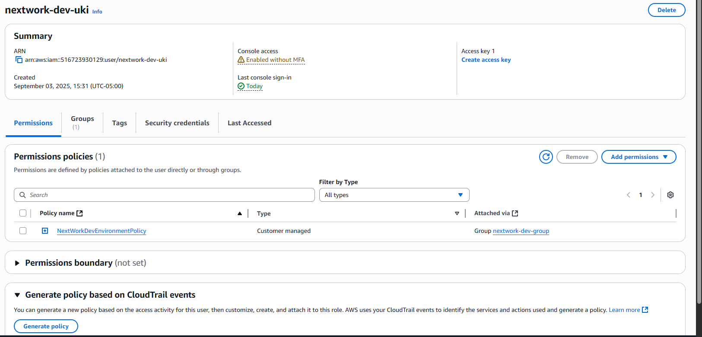
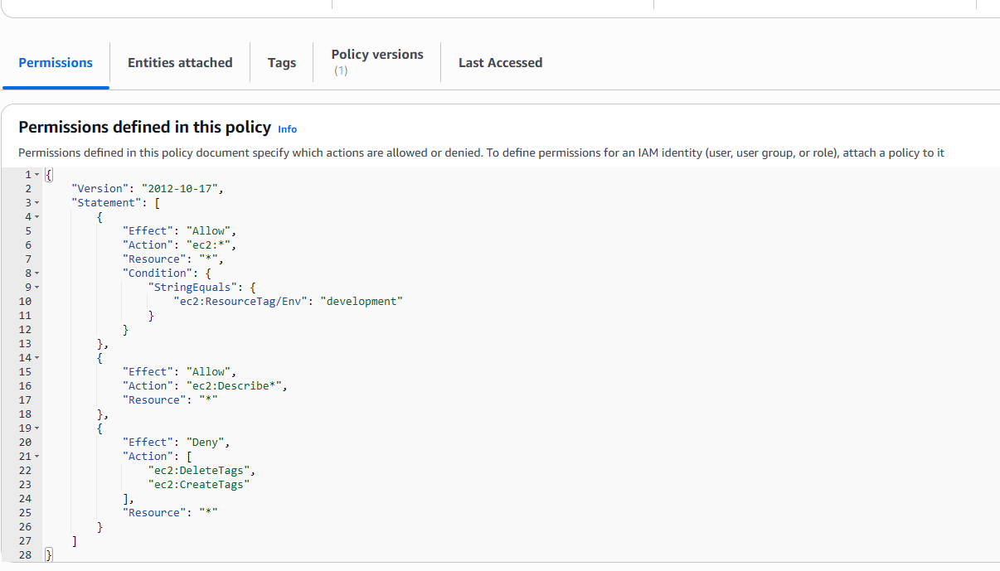
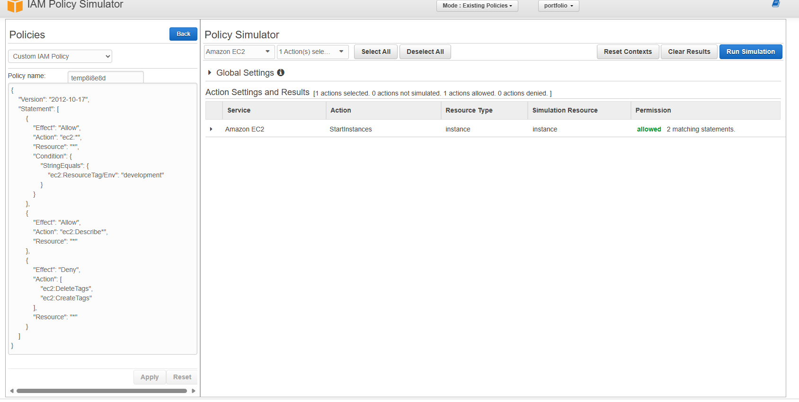
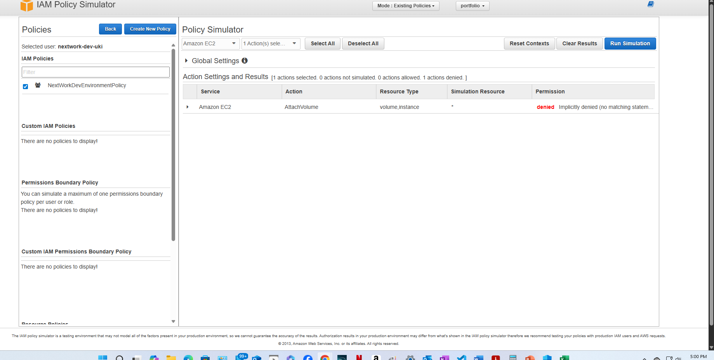

# aws-iam-policy-project
# 🛡️ AWS IAM Policy Project – Principle of Least Privilege

---

## 📌 Overview
This project demonstrates how to configure **AWS Identity and Access Management (IAM)** to implement the **principle of least privilege**.  
It includes the full process of:  
- Creating IAM users  
- Attaching custom JSON IAM policies  
- Restricting access to only the required EC2 actions (`ec2:Describe*`)  
- Testing and validating permissions using the **AWS Policy Simulator**

---

## 🖼️ Project Screenshots
*(Add these images in a folder called `images/` and update the links below once uploaded to GitHub)*

1. **IAM User with Attached Policy**  
   

2. **Custom IAM Policy JSON (DescribeOnly)**  
   

3. **Policy Simulator – Allowed (`ec2:DescribeInstances`)**  
   

4. **Policy Simulator – Denied (`ec2:StartInstances`)**  
   

---

## 🧑‍💻 Skills Demonstrated
- **AWS IAM** (users, groups, and custom policies)  
- **Cloud Security** best practices  
- **Principle of Least Privilege** enforcement  
- **JSON Policy Authoring** (`Effect`, `Action`, `Resource`, `Condition`)  
- **AWS Policy Simulator** for safe permission testing  
- **GitHub Portfolio Building** (repo setup, topics, documentation, screenshots)  

---

## 🚀 Key Takeaways
- IAM **defaults to “deny”** all actions unless explicitly allowed.  
- An **Allow** statement grants access only to listed actions.  
- An **Explicit Deny** always overrides an Allow.  
- The **Policy Simulator** is an essential tool for validating IAM policies before deploying them to production.  
- Documenting your work in a clear GitHub repo helps recruiters and hiring managers see your hands-on cloud security skills quickly.  

---

